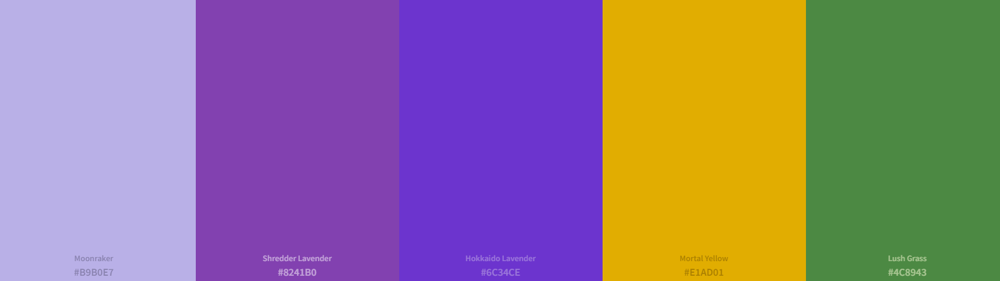

# applied-statistics-assessment
This repository contains my submission for the Applied Statistics module in ATU, Winter 2026

## Iris Dataset
The Fisher's Iris dataset contains 150 rows and 4 columns of data, looking at 150 samples taken from three species of iris: setosa, versicolor and virginica. These samples are measured by four features: sepal width, sepal length, petal width and petal length. There is some interesting context on the background for this dataset and possible uses (Source: A) Iris Dataset Info)
To see the actual data in the iris dataset, please see the iris_data_folder for more details (Source: B) Iris Dataset Literal

### Below is a diagram of the components of the Iris flower. When the data refers to "sepal", "petal", it can be hard to visualize what it is that I am discussing. The imagery shows the differences between the three species used in this dataset. 

#### Source: C)

## Colours used in the Project
### The colours used in the plots throughout the project are based on the colours of the iris flowers. 
### ColorPicker was used to select hex codes from the images, source D): https://pickxcolor.com/

### Palette:

##### Setosa  - #929CF8 
##### Versicolor - #8241B0
##### Virginica - #6C34CE
##### Signal - #D9CE41
##### Stem - #447B29

## References:

### In this README:
#### A) Iris Dataset Info: GeeksforGeeks (https://www.geeksforgeeks.org/iris-dataset/)
#### B) Iris Dataset Literal: UC Irvine Machine Learning Repository (Source: https://archive.ics.uci.edu/dataset/53/iris)
#### C) Sepal and Petal Lengths and Widths Diagram: MachineLearning4ya (https://machinelearning4ya.blogspot.com/2022/04/iris-flowers-classification-using.html)
#### D) Colour Palette Generator: Colorkit (https://colorkit.co/color-palette-generator/b9b0e7-8241b0-6c34ce-e1ad01-4c8943/)

# END